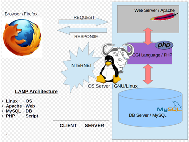
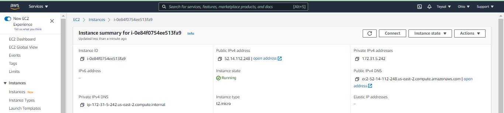
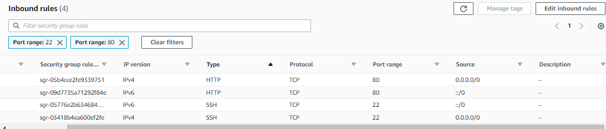
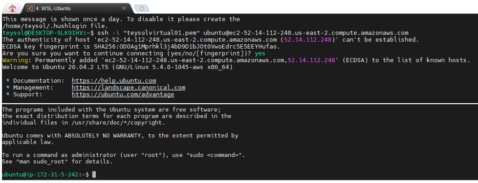
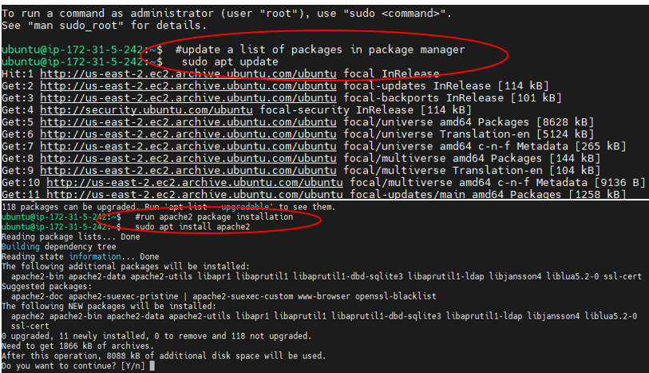
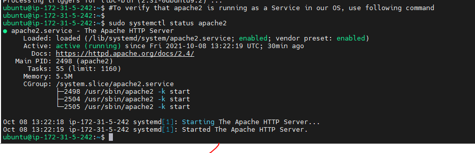
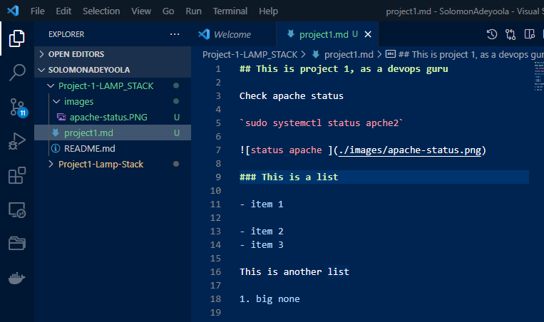
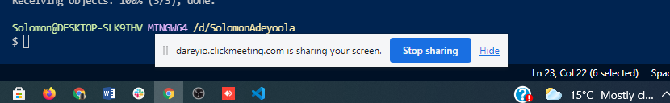

# Web Stack Implementation of LAMP (Linux, Apache, MySQL, PHP)

## Introduction: 
### Technology Stack- A technology stack is a set of frameworks and tools used to develop a software product.
### LAMP stands for a technology stack tool suite with Linux running as the OS; Apache as the webserver; MySQL as the database; PHP as the server-side scripting language 

*LAMP Architecture, Source: K7. India* 

### Step 0: Setting up EC2 Instance on AWS

Launched EC2 instance of Linux Ubuntu Server 20.04 LTS (HVM) and named it as pbl_p1_lamp. Created security group with relevant ports opened and also created and saved my private key to be used for SSH into the EC2 instance.

*EC2 Instance Linux Ubuntu Server 20.04 1 CPU 8G Storage*

*Security: Opened ports*

*SSH connection from client to EC2 Instance*

### Step 1: Installing Apache and updating the firewall

' #update a list of packages in package manager

  sudo apt update

  #run apache2 package installation

  sudo apt install apache2'

*Screenshot for Apache Server installation and Startup*

### This is a list

- item 1

- item 2
- item 3

This is another list

1. big none

2. big two

