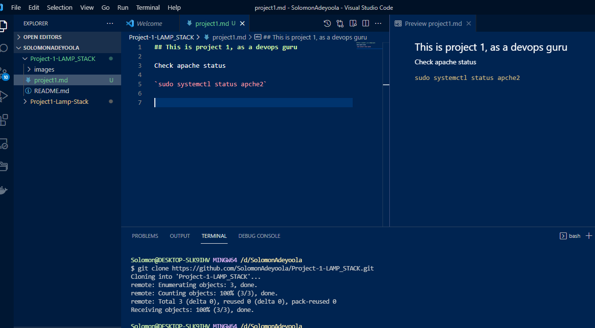

# Web Stack Implementation of LAMP (Linux, Apache, MySQL, PHP)

## Introduction: 
### Technology Stack- A technology stack is a set of frameworks and tools used to develop a software product.
### LAMP stands for a technology stack tool suite with Linux running as the OS; Apache as the webserver; MySQL as the database; PHP as the server-side scripting language 

** *LAMP Architecture, Source: K7. India* **

### This is a list

- item 1

- item 2
- item 3

This is another list

1. big none

2. big two

