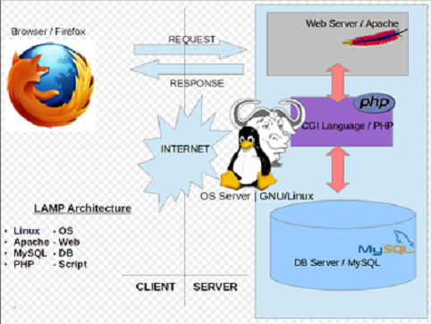
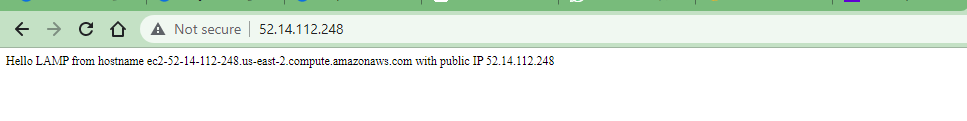
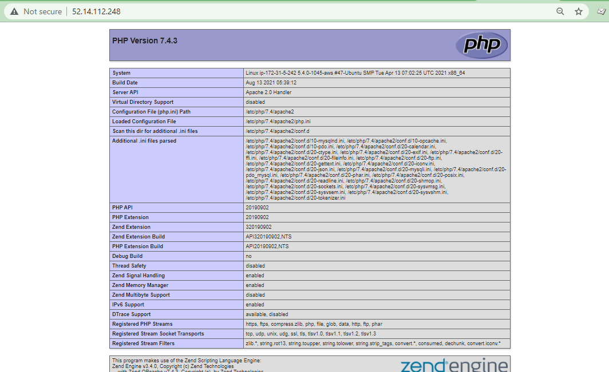

# Web Stack Implementation of LAMP (Linux, Apache, MySQL, PHP)

## Introduction: 
### Technology Stack- A technology stack is a set of frameworks and tools used to develop a software product.
### LAMP stands for a technology stack tool suite with Linux running as the OS; Apache as the webserver; MySQL as the database; PHP/Python/Perl as the server-side scripting language 

*LAMP Architecture, Source: K7. India* 

### Step 0: Setting up EC2 Instance on AWS

Launched EC2 instance of Linux Ubuntu Server 20.04 LTS (HVM) and named it as pbl_p1_lamp. Created security group with relevant ports opened and also created and saved my private key to be used for SSH into the EC2 instance.

*EC2 Instance Linux Ubuntu Server 20.04 1 CPU 8G Storage*

*Security: Opened ports*

*SSH connection from client to EC2 Instance*

### Step 1: Installing Apache and updating the firewall

` #update a list of packages in package manager`

   `sudo apt update`

` #run apache2 package installation`

  `sudo apt install apache2`

*Screenshot for Apache Server installation and Startup*

*Screenshot of Apache webpage*

### Step 2: Installing mysql
` sudo apt install mysql-server`

` sudo mysql_secure_installation`

*Screenshot of MySQL*

### Step 3:Installing php

*Screenshot of PHP_Install*

### Step 4: Creating a virtual host for your website using apache

` #Create the directory for projectlamp`

  `sudo mkdir /var/www/projectlamp `

` #assign ownership of the directory with your current system user:` 

`  sudo chown -R $USER:$USER /var/www/projectlamp`

` #create and open a new configuration file in Apache’s sites-available directory using your preferred command-line editor.`

` sudo nano /etc/apache2/sites-available/projectlamp.conf `

`	<VirtualHost *:80>`
`   	 ServerName projectlamp`
`   	 ServerAlias www.projectlamp `
`   	 ServerAdmin webmaster@localhost`
`   	 DocumentRoot /var/www/projectlamp`
`    	 ErrorLog ${APACHE_LOG_DIR}/error.log`
`   	 CustomLog ${APACHE_LOG_DIR}/access.log combined`
`	</VirtualHost> `

` sudo ls /etc/apache2/sites-available`

`#==>>>>>000-default.conf  default-ssl.conf  projectlamp.conf`

`#a2ensite command to enable the new virtual host`

` sudo a2ensite projectlamp`

`#To disable Apache’s default website use a2dissite command`

` sudo a2dissite 000-default`

`#To make sure your configuration file doesn’t contain syntax errors`

` sudo apache2ctl configtest`

`#Finally, reload Apache so these changes take effect`

` sudo systemctl reload apache2`

`#new website is now active, but the web root /var/www/projectlamp is still empty. Create an index.html file in that location so that we can test that the virtual host works as expected:`

`sudo echo 'Hello LAMP from hostname' $(curl -s http://169.254.169.254/latest/meta-data/public-hostname) 'with public IP' $(curl -s http://169.254.169.254/latest/meta-data/public-ipv4) > /var/www/projectlamp/index.html`

`# http://52.14.112.248:80 --open in web browser`

*Screenshot of Virtual host webpage*

### Step 5 — Enable PHP on the Website

 `#Edit the /etc/apache2/mods-enabled/dir.conf file and change the order in which the index.php file is listed within the DirectoryIndex directive:`

 `sudo nano /etc/apache2/mods-enabled/dir.conf`

 <IfModule mod_dir.c>
    #Change this:
        #DirectoryIndex index.html index.cgi index.pl index.php index.xhtml index.htm
        #To this:
        DirectoryIndex index.php index.html index.cgi index.pl index.xhtml index.htm
</IfModule>

`#reload Apache so the changes take effect`

`sudo systemctl reload apache2`

`#Create a new file named index.php inside your custom web root folder:`

`nano /var/www/projectlamp/index.php`

`# write `

`<?php `

`phpinfo();`

*Screenshot of php_enabled*

`#In other not to divulge sensitive info. it’s best to remove the file created about the PHP environment -and the Ubuntu server. Hence use rm command to remove`

`sudo rm /var/www/projectlamp/index.php`

# Project 1 completed!